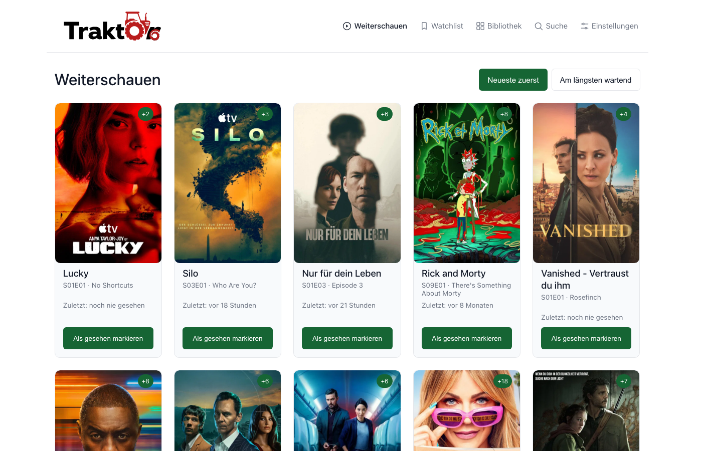
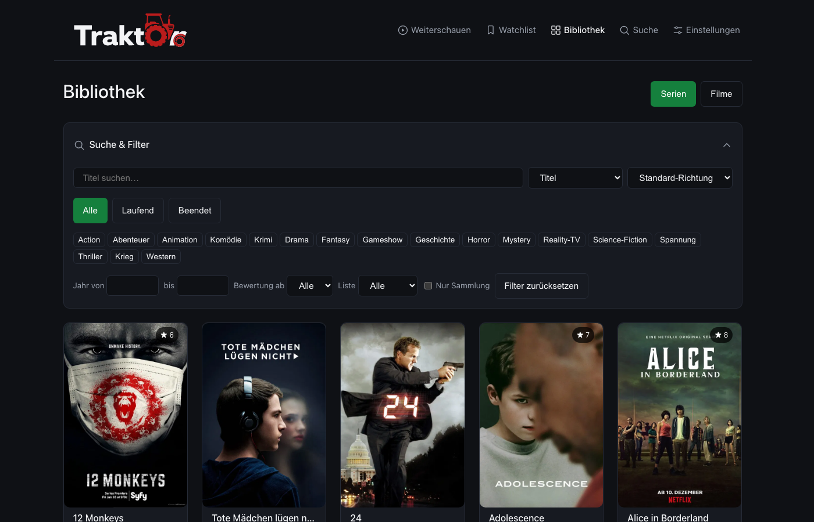

<div align="center">
  

  <p><strong>A lightweight, self-hosted companion for your Trakt.tv library.</strong></p>

  <p>
    
    
    
  </p>
  <p>
    
    
    
    
    
  </p>
</div>

## Why

Trakt.tv's own web UI is cluttered and slow to get a straight answer out of: *what should I watch next?* TraktOr is a small, self-hosted frontend on top of your existing Trakt account that answers exactly that question. A Continue Watching queue, a searchable library, and nothing else you didn't ask for.

## Features

- **Continue Watching** — next episode per show, sorted by newest or longest waiting, one click (with
  confirmation) to mark it (and any earlier gaps in that season) as watched
- **Library** — search and filter your shows and movies by genre, status, year and rating
- **Watchlist** — tracks Trakt's watchlist independently from watch history, with the same
  search/filter/sort tools as Library and one-click add/remove (with confirmation)
- **Search & Discover** — find any show or movie on trakt.tv, even ones brand new to your account, and
  either add it to the watchlist or start watching right away; an empty search shows Recommended,
  Trending and Popular tabs, and every show/movie detail page has a "similar titles" section
- **Collection** — mark movies and individual show seasons as owned, synced to Trakt's native Collection
  feature; a badge on Library/Watchlist cards turns orange once you've caught up on watching but a
  newer season isn't in your collection yet
- **Private notes** — a short note per movie/show, visible only to you and never synced to Trakt (Trakt's
  own Notes feature is VIP-only)
- **Cancel a show** — drop it from Continue Watching without touching watch history, one click to
  resume tracking later
- **Ratings** — rate shows and movies, synced straight to Trakt
- **Automatic sync** — connects via Trakt OAuth, syncs nightly through a self-gating cron job that's safe
  to run on a single shared-hosting cron slot, plus a manual "sync now"
- **Multi-language UI** — English and German out of the box; new languages are just a new file under
  `frontend/src/lib/i18n/locales/`, auto-discovered, no code changes needed
- **Light/dark mode** — follows your OS by default, with a manual override that's saved to your account
- **Responsive** — usable one-handed on a phone, not just at a desk
- **Deploy anywhere** — works at a domain root or any subfolder without touching code, single-user
  password login, no framework/Composer dependency on the backend

## Screenshots

<p align="center">
  
  <br /><br />
  
</p>

## Tech Stack

| Layer     | Stack                                                              |
| --------- | ------------------------------------------------------------------- |
| Frontend  | [Svelte 5](https://svelte.dev) + TypeScript, [Vite](https://vite.dev), no SvelteKit (static SPA build) |
| Backend   | Plain PHP 8.1+, no framework, no Composer — a tiny router + PSR-4-style autoloader |
| Database  | MySQL 8 (or MariaDB with JSON column support)                      |
| Data      | [Trakt.tv API](https://trakt.docs.apiary.io/) (source of truth) + [TMDB API](https://developer.themoviedb.org/) (localized titles/artwork) |

## Getting Started

### Prerequisites

- PHP 8.1+ with the `pdo_mysql` and `curl` extensions
- MySQL 8 (or compatible)
- Node.js 20+
- A [Trakt.tv API app](https://trakt.tv/oauth/applications) (client ID + secret)
- A [TMDB API key](https://www.themoviedb.org/settings/api) (v3 auth)

### Local setup

```bash
git clone https://github.com/6c756b/traktOr.git
cd traktOr

# Backend config
cp backend/config/config.example.php backend/config/config.php
# fill in db credentials, trakt client_id/secret, tmdb api_key, app.password_hash
# (generate a password hash with: php -r "echo password_hash('yourpassword', PASSWORD_BCRYPT), PHP_EOL;")

# Database schema -- fresh/empty database: import ONE file, backend/migrations/install_all.sql
# (it's a straight concatenation of every 00N_*.sql migration below, in order). On shared hosting
# without shell access, upload this same file via phpMyAdmin's "Import" tab -- no CLI needed.
mysql -u root -p your_database < backend/migrations/install_all.sql

# Already have an older install? Do NOT run install_all.sql (it re-creates every table from
# scratch) -- apply only the individual migrations you're missing, in order:
mysql -u root -p your_database < backend/migrations/001_init.sql
mysql -u root -p your_database < backend/migrations/002_hardening.sql
mysql -u root -p your_database < backend/migrations/003_theme.sql
mysql -u root -p your_database < backend/migrations/004_watchlist.sql
mysql -u root -p your_database < backend/migrations/005_season_structure.sql
mysql -u root -p your_database < backend/migrations/006_collection.sql
mysql -u root -p your_database < backend/migrations/007_notes.sql

# Frontend dependencies
cd frontend && npm install && cd ..

# Start both dev servers (PHP on :8000, Vite on :5173)
./dev/start.sh
```

Open `http://localhost:5173`, log in with the password you hashed above, then connect your Trakt account from Settings.

### Deploying

`deploy/deploy.sh` builds the frontend and stages a ready-to-upload folder (`dist-ftp/`) with both the frontend build and the backend — optionally uploading it straight via FTP if `deploy/.env` (copy from `deploy/.env.example`) is configured with host credentials and `lftp` is installed. Without either, it still does the build + staging so you can upload the result with any FTP client. See `deploy/.env.example` for the `BASE_PATH` setting if you're hosting in a subfolder rather than at the domain root.

`backend/config/config.php` is deliberately never part of the automated upload — it holds your secrets and is uploaded once, by hand.

## Changelog

See [CHANGELOG.md](CHANGELOG.md) for release notes and what's planned next.

## Getting Help

This is a personal project built for a single-user setup — there's no support channel beyond [GitHub Issues](https://github.com/6c756b/traktOr/issues). Bug reports and feature suggestions are welcome there.

## Contributing

Issues and pull requests are welcome. This is a small, opinionated codebase without a framework on either side — please keep additions consistent with the existing style (plain PHP, no new dependencies without good reason, English code/comments).

## License

[MIT](LICENSE)
